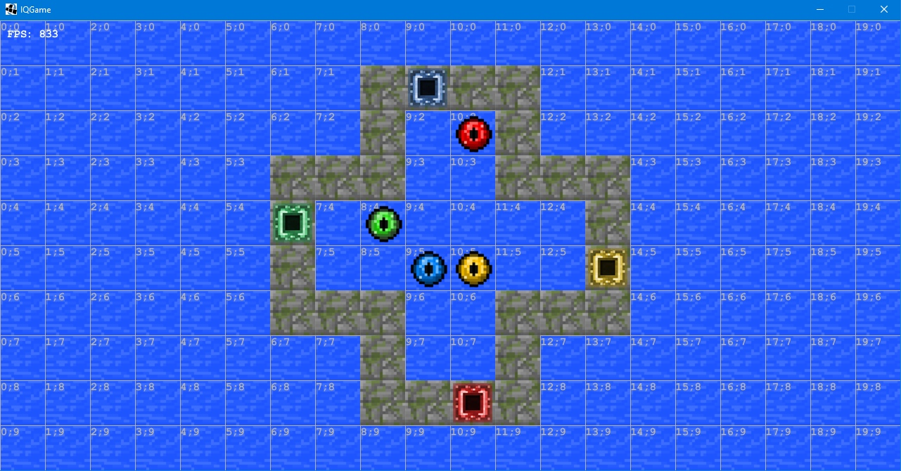
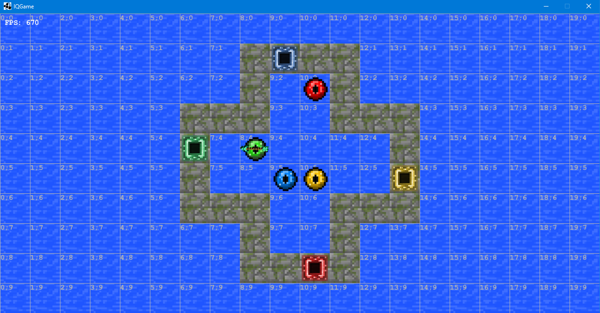
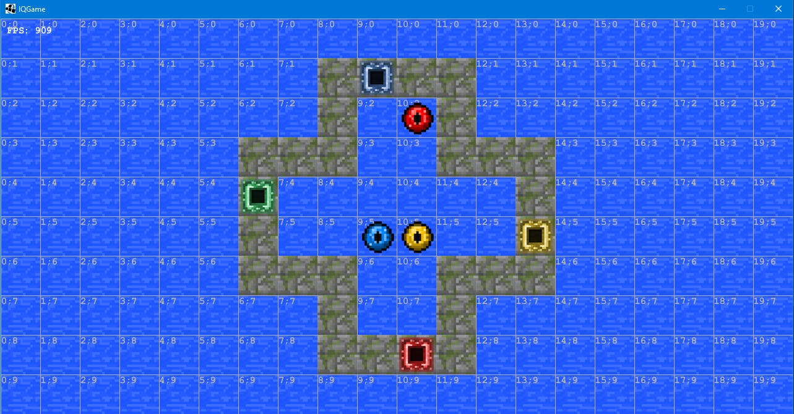
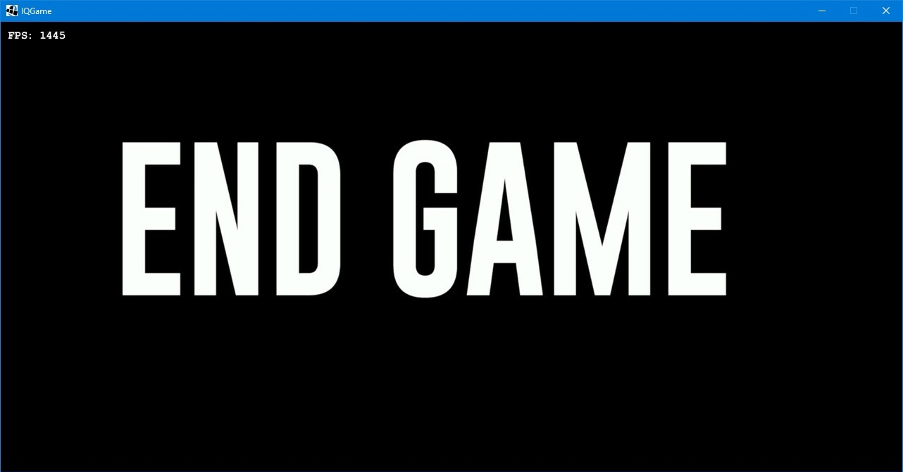

# IQGame

### Управление
1. Зажимает ЛКМ на шарике, который мы хотим переместить
2. Выбираем направление, не отпуская ЛКМ (стрелочка на мячике указывает куда полетит мячик) 
3. Отпускаем ЛКМ, в результате чего, мячик перемещается

### Пример прохождения уровня

### Макеты экранных форм
**Начало игры**

Необходимо, чтобы все мячики на поле попали в ворота своего цвета

**Выбор мячика и направления, куда он полетит**

**Мячик попадает в ворота своего цвета**

**Конец игры**

